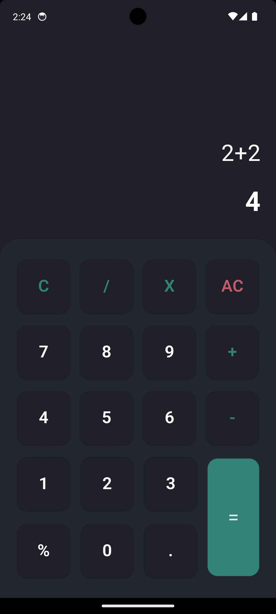
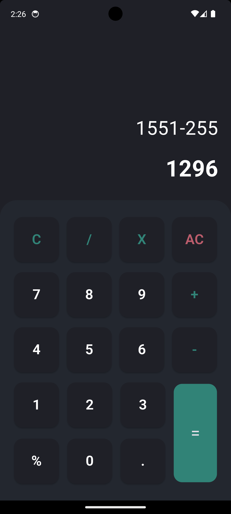
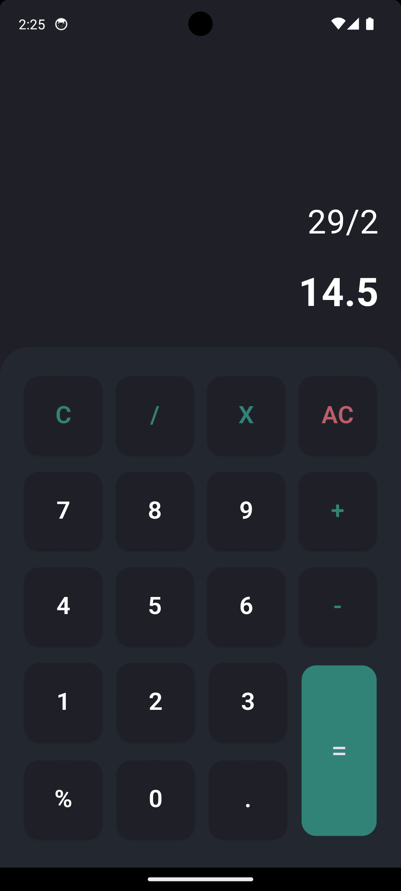

# Calculator App

A simple calculator app built using Flutter. This app supports basic arithmetic operations like addition, subtraction, multiplication, and division. It also features a custom app icon and a clean, user-friendly interface.

## Features

- Basic arithmetic operations: addition, subtraction, multiplication, and division.
- Separate input and output fields.
- Responsive design.
- Custom app icon.
- Built using the Flutter framework.

## Screenshots

### Calculator Screenshots
<div style="display: flex; flex-wrap: wrap; gap: 20px;">
  
  
</div>
<div style="display: flex; flex-wrap: wrap; gap: 20px;">
  
  
</div>

## About

This calculator app is designed to provide a simple and intuitive interface for performing basic arithmetic operations. The input and output fields are positioned on the right side of the screen, with the input field above the output field for a streamlined user experience. The app also includes a custom app icon, giving it a unique and professional look.

## Installation

1. Clone the repository:
    ```bash
    git clone https://github.com/th3varun/calculator_app.git
    ```
2. Navigate to the project directory:
    ```bash
    cd calculator_app
    ```
3. Get the dependencies:
    ```bash
    flutter pub get
    ```
4. Run the app:
    ```bash
    flutter run
    ```

## Dependencies

- [Provider](https://pub.dev/packages/provider)
- [Function Tree](https://pub.dev/packages/function_tree)
- [Flutter](https://flutter.dev/)

## Usage

- Tap the buttons to input numbers and operations.
- Press `=` to see the result.
- Use `C` to clear the last entry.
- Use `AC` to clear all entries.

## Contributing

Feel free to fork this repository and contribute by submitting a pull request. Any contributions are welcome and appreciated!

## License

This project is licensed under the MIT License - see the [LICENSE](LICENSE) file for details.
